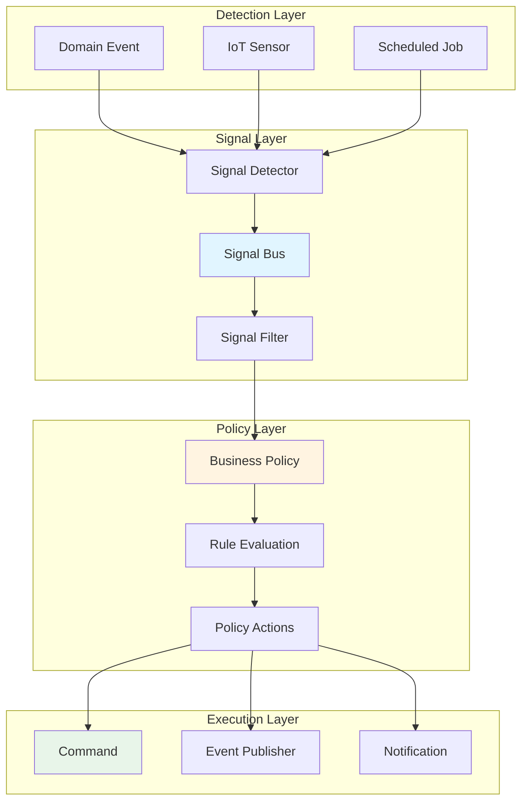

# Signal-Based Reactive Architecture Overview

> **Status**: Draft  
> **Owner**: Architecture Team  
> **Last updated**: 2026-01-25

---

## Purpose

This document provides a **high-level overview** of {{ PRODUCT_NAME }}'s signal-based reactive architecture, which enables **real-time, intent-driven decisioning** with **rigorous business logic governance** within a CQRS/Event Hub architecture.

**Target audience:** Architects, tech leads, and senior developers evaluating the architecture.

---

## 1. Executive Summary

### What is Signal-Enhanced Reactive Architecture?

{{ PRODUCT_NAME }}'s signal-enhanced reactive architecture **combines** event-sourcing and signals in a tiered approach:

**Event-Sourcing (Write Model/Persistence):**
- **Domain events** - Immutable facts persisted for audit trail, time-based queries, and analytics
- **Event Hub** - High-throughput event streaming and fan-out
- **Message-Driven Application Framework Transactional Outbox** - Guarantees event delivery from database to Event Hub

**Signals (Read Model/UI Reactivity):**
- **Signal primitives** - Lightweight, typed notifications for threshold breaches and UI updates
- **In-process signal bus** - Fast, low-latency reactive processing
- **SignalR push** - Real-time client updates without polling

**Message-Driven Application Framework as Bridge:**
- Transforms heavy domain events into lightweight reactive signals
- Enables granular UI updates (e.g., flash specific "Balance" field) without full page reload

### Why Combine Events and Signals?

**Problem:** Events alone require polling for threshold detection and don't enable granular real-time UI updates.

**Solution:** Signals complement events by enabling **immediate, targeted reactions** to significant conditions.

**How they work together:**
1. **Command** → User action (e.g., "Submit")
2. **Event** → System saves immutable event to database (audit trail)
3. **Bridge** → Message-Driven Application Framework picks up event from Transactional Outbox
4. **Signal** → Message-Driven Application Framework pushes specific data update via SignalR
5. **UI** → Signal Store receives it; specific field updates without page reload

**Benefits:**
- ✅ **Events** provide audit trail, compliance, and analytics
- ✅ **Signals** provide snappy, high-performance user experience
- ✅ **10x faster reaction time** (milliseconds vs polling intervals)
- ✅ **100% auditable decision paths** (event → signal → action traceability)
- ✅ **Clear separation of concerns** (events = persistence, signals = reactivity)

---

## 2. Conceptual Model

### 2.1 Three-Layer Reactive Model



### 2.2 Signal vs Event vs Command (Tiered Architecture)

| Aspect | Event | Signal | Command |
|--------|-------|--------|---------|
| **Semantic** | Historical fact (immutable) | Condition/intent (reactive) | Directive action |
| **Layer** | Write Model (Persistence) | Read Model (UI/Local Logic) | Execution |
| **Timing** | After-the-fact | Real-time | Future action |
| **Scope** | Pub/sub (Event Hub) | In-process + SignalR push | Point-to-point (Service Bus) |
| **Example** | "AssetConditionChanged" event saved to DB | "Asset CI dropped below 0.4" signal → UI | "Create work order for asset X" |
| **Purpose** | Audit trail, analytics, compliance | Trigger reactions, real-time UI updates | Execute operations |
| **Technology** | Event Hub + Transactional Outbox | Signal Bus + SignalR + Signal Store | Service Bus |

**Tiered Workflow:**
```
1. Command (User Action)
   ↓
2. Event (Persisted via Message-Driven Application Framework Transactional Outbox)
   ↓
3. Event Hub → Read Model Update
   ↓
4. Signal Detection (threshold breach, condition met)
   ↓
5. Signal Raised → Policy Evaluation
   ↓
6. Signal Pushed via SignalR → Client Signal Store
   ↓
7. UI Updates (granular, without full page reload)
   ↓ (if action required)
8. Command Generated → Service Bus → Action Executed
```

**Decision Matrix:**
| Use Case | Pattern | Why |
|----------|---------|-----|
| Persist state change | **Event** | Audit trail, time-based queries, compliance |
| Update read model | **Event** → Read Model Projection | Eventual consistency, denormalized views |
| Real-time UI update | **Signal** (from Event) | Snappy UX, granular field updates, no polling |
| Threshold breach reaction | **Signal** (from Event) | Immediate reaction without scheduled jobs |
| Trigger background work | **Command** (from Signal) | Durable processing, guaranteed execution |

---

## 3. Core Components

### 3.1 Signal Primitives

All signals inherit from base `Signal` type:

```csharp
public abstract record Signal
{
    public string SignalId { get; init; }
    public required string SignalType { get; init; }
    public DateTimeOffset Timestamp { get; init; }
    public required string SourceId { get; init; }
    public required string CorrelationId { get; init; }
    public SignalPriority Priority { get; init; }
}
```

**Domain-Specific Signals:**
- `AssetConditionThresholdSignal` - Asset CI breach
- `DeficiencyEscalationSignal` - Deficiency count/severity exceeded
- `PredictiveMaintenanceSignal` - ML model prediction
- `WorkOrderPrioritySignal` - Work order urgency change
- `FacilityMetricsSignal` - Portfolio-level KPI breach

### 3.2 Signal Bus

**Interface:**
```csharp
public interface ISignalBus
{
    Task RaiseAsync<TSignal>(TSignal signal, CancellationToken ct = default);
    IDisposable Subscribe<TSignal>(Func<TSignal, CancellationToken, Task> handler);
}
```

**Characteristics:**
- In-process (default): < 1ms latency, 10,000+ signals/sec
- Event Hub bridging: Cross-service propagation when needed
- OpenTelemetry instrumented: Full tracing

### 3.3 Business Policies

**Interface:**
```csharp
public interface IBusinessPolicy<TSignal> where TSignal : Signal
{
    Task<PolicyEvaluationResult> EvaluateAsync(TSignal signal, CancellationToken ct);
}
```

**Versioned Policies:**
- Track policy version for compliance
- Audit who approved policy and when
- Support A/B testing and gradual rollout
- Align with ISO/IEC 42001, NIST AI RMF

**Example:**
```csharp
public class AssetConditionThresholdPolicy_V2 : 
    VersionedBusinessPolicy<AssetConditionThresholdSignal>
{
    public override string PolicyId => "AssetConditionThreshold";
    public override int Version => 2;
    public override string ApprovedBy => "Chief Engineer, Jane Doe";
    public override string ComplianceFramework => "ISO 55000";
    
    public override async Task<PolicyEvaluationResult> EvaluateAsync(
        AssetConditionThresholdSignal signal,
        CancellationToken ct)
    {
        // Business logic here
    }
}
```

---

## 4. Architecture Integration

### 4.1 Integration with CQRS

Signals complement CQRS by providing **reactive read model updates** without polling.

```
Write Model → Domain Event → Signal Detector → Signal Raised → Read Model Updated
```

**Benefits:**
- Read models react immediately to threshold breaches
- No polling queries for condition monitoring
- Clear separation: events = state changes, signals = attention triggers

### 4.2 Integration with Event Hub

**Signal-to-Event Bridging:**
- In-process signals (default): Fast, local handling
- Bridged signals: Published to Event Hub for cross-service consumption
- Configurable per signal type

```csharp
services.AddSignalBus(options =>
{
    // Bridge critical signals to Event Hub
    options.BridgeToEventHub<AssetConditionThresholdSignal>();
    options.BridgeToEventHub<PredictiveMaintenanceSignal>();
    
    // Keep local (high-frequency, low-priority)
    // options.BridgeToEventHub<WorkOrderPrioritySignal>();
});
```

### 4.3 Integration with Service Bus

Signals trigger **commands** sent to Service Bus for durable processing.

```
Signal Raised → Policy Evaluated → Command Generated → Service Bus → Command Handler
```

**Example:**
```csharp
public class AssetConditionThresholdSignalHandler : 
    ISignalHandler<AssetConditionThresholdSignal>
{
    public async Task HandleAsync(AssetConditionThresholdSignal signal, CancellationToken ct)
    {
        // Generate command for Service Bus
        await _commandQueue.SendAsync(new CreateWorkOrderCommand
        {
            AssetId = signal.AssetId,
            Priority = WorkOrderPriority.High,
            TriggeredBySignalId = signal.SignalId
        });
    }
}
```

### 4.4 Integration with AI/MCP

Signals can trigger **AI-assisted policy evaluation** with governance.

```
Signal → AI Policy → LLM Call (governed) → Decision → Action
```

**Governance:**
- Approved prompts only (no user input)
- PII redaction before LLM calls
- Output validation
- Full audit trail (signal → prompt → response → action)

---

## 5. Key Design Principles

### 5.1 Cognitive Load Reduction

**Principle:** Developers understand signal flow from type signature alone.

✅ **Good:** `AssetConditionThresholdSignal` (self-documenting)  
❌ **Bad:** `GenericSignal` with dictionary payload

### 5.2 Black Box Modularity

**Principle:** Signal handlers are independently replaceable.

```csharp
// Handler contract defines complete interface
public interface ISignalHandler<TSignal> where TSignal : Signal
{
    Task HandleAsync(TSignal signal, CancellationToken ct);
}

// Implementation can be swapped without affecting signal bus
```

### 5.3 Risk Isolation

**Principle:** Handler failures don't cascade.

```csharp
// Signal bus isolates failures
foreach (var handler in handlers)
{
    try
    {
        await handler.HandleAsync(signal, ct);
    }
    catch (Exception ex)
    {
        _logger.LogError(ex, "Handler failed");
        if (!continueOnError) throw;
    }
}
```

### 5.4 Future-Proof Extensibility

**Principle:** Adding signal types doesn't break existing handlers.

- New signals register independently
- Existing handlers unaffected
- Service boundaries respected

---

## 6. Observability and Governance

### 6.1 OpenTelemetry Tracing

All signal processing is traced:

```
Activity: Signal.Raise
├── signal.type: AssetConditionThreshold
├── signal.id: S-12345
├── signal.priority: High
└── correlation.id: C-67890
    ├── Activity: Policy.Evaluate
    │   ├── policy.id: AssetConditionThreshold
    │   ├── policy.version: 2
    │   └── policy.result: CreateWorkOrder
    └── Activity: Command.Send
        ├── command.type: CreateWorkOrderCommand
        └── command.id: CMD-11111
```

### 6.2 Computable Governance

All signal-to-decision paths are auditable:

```sql
-- Trace signal to decision to action
SELECT 
    s.signal_id,
    s.signal_type,
    pe.policy_id,
    pe.policy_version,
    pe.actions,
    wo.work_order_id
FROM signal_audit s
JOIN policy_evaluation_audit pe ON pe.signal_id = s.signal_id
JOIN work_orders wo ON wo.triggered_by_signal_id = s.signal_id
WHERE s.signal_id = 'S-12345';
```

**Compliance queries:**
- "Which signals triggered work order WO-67890?"
- "What business rules were evaluated for signal S-12345?"
- "Why was asset ASSET-001 flagged for maintenance?"

---

## 7. Performance Characteristics

| Metric | Target | Notes |
|--------|--------|-------|
| Signal raise (in-process) | < 1ms | Synchronous handler execution |
| Signal raise (fire-and-forget) | < 100μs | Background task enqueue |
| Signal handler execution | < 50ms | Simple business rule evaluation |
| Signal-to-Event bridge | < 100ms | Event Hub publish |
| End-to-end (signal → command) | < 500ms | Full reactive workflow |
| Throughput (in-process) | 10,000+ signals/sec | Per service instance |
| Throughput (Event Hub) | 1,000 signals/sec | Per partition |

---

## 8. Documentation Structure

### Core Architecture Documents

1. **[Signal-Based Reactive Architecture](070-signal-reactive-architecture.md)**
   - Complete technical specification
   - Signal types and primitives
   - Detection patterns
   - Integration with CQRS/Event Hub

2. **[Business Logic Governance](075-business-logic-governance.md)**
   - Component-based Scalable Logical Architecture pattern mappings
   - Business rule policies
   - AI governance integration
   - Authorization patterns

3. **[Signal Code Organization](078-signal-code-organization.md)**
   - Project structure
   - File naming conventions
   - Component-based Scalable Logical Architecture-to-{{ PRODUCT_NAME }} mappings
   - Service registration patterns

### Implementation Guides

4. **[Signal Patterns Guide](../../04-events-and-messaging/signal-patterns.md)**
   - Practical implementation patterns
   - Signal routing strategies
   - Handler patterns (transactional, idempotent, compensating)
   - Performance optimization
   - Testing patterns

### Reference Documents

5. **[Component-based Scalable Logical Architecture Summary](../../Examples/Component-based Scalable Logical Architecture/Component-based Scalable Logical ArchitectureSummary.md)**
   - Component-based Scalable Logical Architecture framework overview
   - Object stereotypes
   - Business rules framework
   - Data portal patterns

6. **[AI Governance Architecture](../../08-security-and-compliance/120-ai-governance-architecture.md)**
   - AI governance framework
   - Prompt validation
   - PII redaction
   - Compliance (ISO/IEC 42001, NIST AI RMF)

---

## 9. Getting Started

### For Architects

1. Read: [Signal-Based Reactive Architecture](070-signal-reactive-architecture.md)
2. Read: [Business Logic Governance](075-business-logic-governance.md)
3. Review: [Signal Patterns Guide](../../04-events-and-messaging/signal-patterns.md)
4. Evaluate: Alignment with organizational goals

### For Developers

1. Read: [Signal Code Organization](078-signal-code-organization.md)
2. Read: [Signal Patterns Guide](../../04-events-and-messaging/signal-patterns.md)
3. Try: Implement a simple signal handler
4. Test: Use signal test harness for validation

### For DevOps/SRE

1. Review: Observability section in [Signal Architecture](070-signal-reactive-architecture.md)
2. Configure: OpenTelemetry dashboards for signal metrics
3. Set up: Alerts for signal processing failures
4. Monitor: Signal throughput and latency

---

## 10. Frequently Asked Questions

### Why not just use events for everything?

**Events** represent **what happened** (historical facts).  
**Signals** represent **conditions requiring attention** (reactive triggers).

Conflating the two creates confusion and couples read models to business logic.

### Why not use MediatR or MassTransit?

{{ PRODUCT_NAME }} uses **WolverineFx** (see [ADR-0003](../../02-decision-records/adr-0003-use-wolverinefx.md)).

Signals are **in-process primitives** optimized for sub-millisecond latency. MassTransit is designed for distributed messaging (overkill for in-process signals).

### How do signals differ from domain events?

| Aspect | Domain Event | Signal |
|--------|--------------|--------|
| Timing | After state change | At threshold breach |
| Persistence | Always persisted | Optional (ephemeral) |
| Purpose | Audit, analytics | Reactive triggers |
| Scope | Event Hub (pub/sub) | In-process (default) |

### What about performance overhead?

**In-process signals:** < 1ms latency, 10,000+ signals/sec  
**Event Hub bridging:** < 100ms latency, 1,000 signals/sec/partition

Signals are **faster than polling** (eliminates 15-minute delay and database queries).

### How do we test signal-based workflows?

Use **signal test harness** (see [Signal Patterns Guide](../../04-events-and-messaging/signal-patterns.md#61-signal-test-harness)):

```csharp
var harness = new SignalTestHarness();

// Raise signal
await harness.SignalBus.RaiseAsync(signal);

// Wait for command
var command = await harness.WaitForCommandAsync<CreateWorkOrderCommand>(
    c => c.AssetId == "ASSET-001",
    timeout: TimeSpan.FromSeconds(5));

Assert.IsNotNull(command);
```

### How do we handle signal versioning?

**Business policies** are versioned:

```csharp
public class AssetConditionThresholdPolicy_V2 : 
    VersionedBusinessPolicy<AssetConditionThresholdSignal>
{
    public override int Version => 2;
    public override DateTime EffectiveDate => new DateTime(2026, 2, 1);
}
```

**Signal types** evolve via additive changes (add properties, don't remove).

### What about multi-tenancy and release channels?

Policies are **registered per release channel**:

```csharp
services.AddBusinessPolicies(options =>
{
    var channel = _config.GetValue<ReleaseChannel>("ReleaseChannel");
    
    if (channel == ReleaseChannel.Production)
    {
        options.RegisterPolicy<AssetConditionThresholdSignal>(
            new AssetConditionThresholdPolicy_V2());
    }
    else if (channel == ReleaseChannel.UAT)
    {
        options.RegisterPolicy<AssetConditionThresholdSignal>(
            new AssetConditionThresholdPolicy_V3_Beta());
    }
});
```

---

## 11. Success Criteria

### Technical
- ✅ Signal processing latency < 1ms (in-process)
- ✅ Throughput > 10,000 signals/sec/service
- ✅ Zero signal loss during processing
- ✅ 100% OpenTelemetry tracing coverage

### Operational
- ✅ Polling jobs reduced by 80%
- ✅ Database query load reduced by 60%
- ✅ Mean time to reaction improved by 10x
- ✅ Signal handler error rate < 1%

### Governance
- ✅ All signal-to-action paths auditable
- ✅ Business policies versioned and approved
- ✅ AI governance compliance (ISO/IEC 42001)
- ✅ Full provenance for regulatory inquiries

---

## 12. Next Steps

### Immediate Actions
1. Review architecture documents
2. Identify new features requiring signal-based patterns
3. Ensure development team understands signal architecture
4. Validate observability dashboards are configured

### Short-Term (1-3 months)
1. Implement new features using signal-based patterns
2. Monitor performance metrics against targets
3. Refine business policies based on operational feedback
4. Expand signal types as business needs emerge

### Long-Term (3-6 months)
1. Optimize signal handler performance
2. Expand cross-service signal integration as needed
3. Document lessons learned and best practices
4. Continuously improve governance framework

---

## Related Documentation

- **Architecture**: [Signal-Based Reactive Architecture](070-signal-reactive-architecture.md)
- **Governance**: [Business Logic Governance](075-business-logic-governance.md)
- **Code Structure**: [Signal Code Organization](078-signal-code-organization.md)
- **Implementation**: [Signal Patterns Guide](../../04-events-and-messaging/signal-patterns.md)
- **AI Integration**: [AI Governance Architecture](../../08-security-and-compliance/120-ai-governance-architecture.md)
