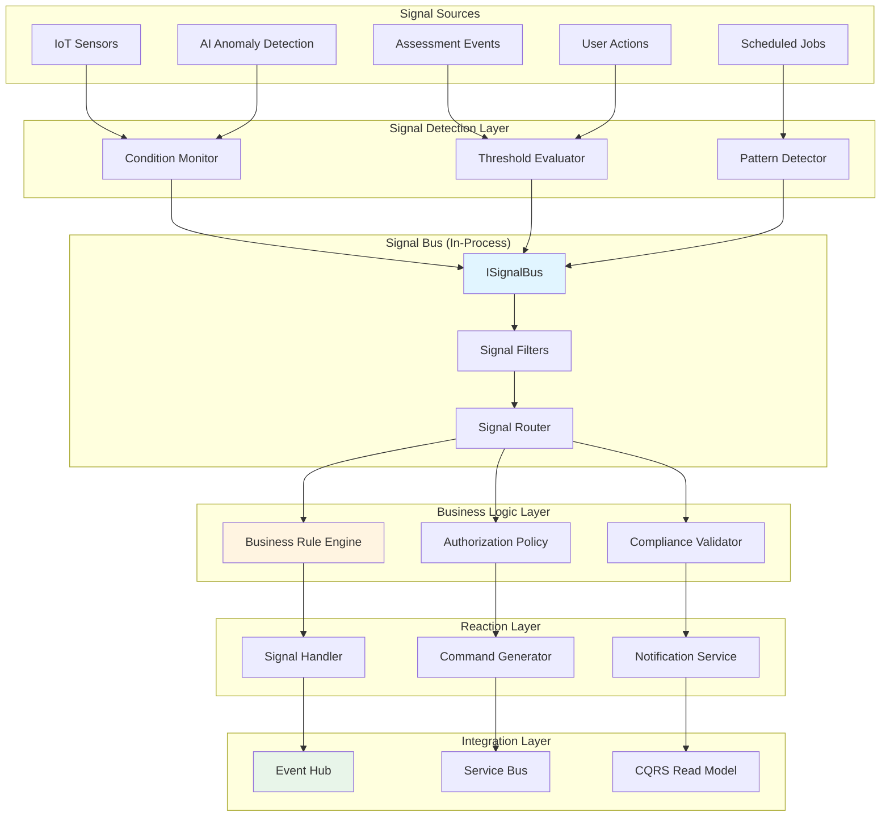
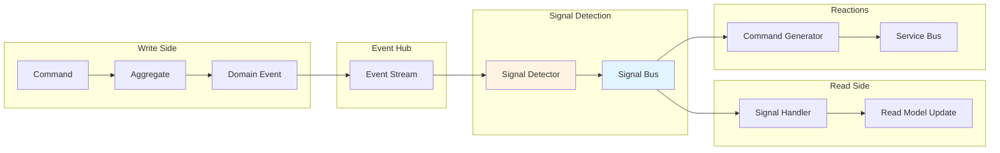

# Signal-Based Reactive Architecture

> **Status**: Draft  
> **Owner**: Architecture Team  
> **Last updated**: 2026-01-25

---

## Purpose

This document defines {{ PRODUCT_NAME }}'s **signal-enhanced reactive architecture** that **combines event-sourcing and signals** in a tiered approach for **real-time decisioning** with **rigorous business logic governance**. 

**Tiered Architecture:**
- **Events (Write Model)** - Immutable facts for persistence, audit trail, and analytics
- **Signals (Read Model)** - Lightweight reactive triggers for real-time UI updates and threshold reactions
- **Message-Driven Application Framework as Bridge** - Transforms heavy domain events into lightweight reactive signals

Signals enable granular reactivity—responding only to specific state changes and pushing targeted updates to UI—while maintaining strict domain rule enforcement.

**Strategic alignment:**
- Combines event-sourcing (persistence) with signals (reactivity) in complementary patterns
- Maintains service boundaries and microservice independence
- Supports AI-driven autonomous decision-making with governance
- Optimizes for long-term maintainability and team scalability
- Delivers snappy, high-performance user experience without polling

---

## 1. Core Concepts

### 1.1 What is a Signal?

A **Signal** is a lightweight, typed notification representing a **specific state transition** or **threshold breach** in the domain.

**Primitive Definition:**
```csharp
/// <summary>
/// Base signal type - all signals inherit from this
/// Signals are immutable, serializable, and self-contained
/// </summary>
public abstract record Signal
{
    public string SignalId { get; init; } = Guid.NewGuid().ToString();
    public required string SignalType { get; init; }
    public DateTimeOffset Timestamp { get; init; } = DateTimeOffset.UtcNow;
    public required string SourceId { get; init; }      // Asset, Facility, or System ID
    public required string CorrelationId { get; init; }
    public SignalPriority Priority { get; init; }
    public Dictionary<string, object> Metadata { get; init; } = new();
}

public enum SignalPriority
{
    Low = 1,
    Normal = 2,
    High = 3,
    Critical = 4
}
```

### 1.2 How Events and Signals Work Together (Tiered Architecture)

Events and signals are **complementary patterns** used for different purposes:

| Concern | Event | Signal | Command |
|---------|-------|--------|---------|
| **Layer** | Write Model (Persistence) | Read Model (UI/Local Logic) | Execution |
| **Semantic** | Historical fact (immutable) | Condition/intent (reactive) | Directive |
| **Timing** | After-the-fact | Real-time | Future action |
| **Granularity** | State change (complete) | Threshold breach (specific) | Operation request |
| **Scope** | Pub/sub (Event Hub) | In-process + SignalR push | Point-to-point (Service Bus) |
| **Example** | "AssetConditionChanged" (saved to DB) | "Asset CI score < 0.4" (pushed to UI) | "GenerateWorkOrder" |
| **Technology** | Event Hub + Transactional Outbox | Signal Bus + SignalR + Signal Store | Service Bus |

**Key distinction:** 
- **Events** represent **what happened** (persistence, audit trail)
- **Signals** represent **conditions requiring attention** (reactivity, real-time UI)
- **Commands** represent **what to do** (operations, background work)

**Decision Matrix:**
| Use Case | Pattern | Why |
|----------|---------|-----|
| Save state change | **Event** | Audit trail, time-based queries, compliance |
| Update read model | **Event** → Read Model Projection | Eventual consistency, denormalized views |
| Real-time UI update | **Signal** (derived from Event) | Snappy UX, no polling, granular updates |
| Threshold monitoring | **Signal** (derived from Event) | Immediate reaction without scheduled jobs |
| Background work | **Command** (triggered by Signal) | Durable processing, guaranteed execution |

### 1.3 Complete Tiered Flow Example

**Scenario:** User submits a transaction that affects their account balance.

**1. Command (User Action)**
```csharp
// User clicks "Submit" button
await _mediator.Send(new SubmitTransactionCommand 
{ 
    UserId = "user-123", 
    Amount = 100.00m 
});
```

**2. Event (Event-Sourcing - Write Model)**
```csharp
// System validates business rules and saves immutable event to database
var @event = new TransactionCompletedEvent
{
    EventId = Guid.NewGuid().ToString(),
    EventType = "TransactionCompleted",
    SchemaVersion = 1,
    Timestamp = DateTimeOffset.UtcNow,
    CorrelationId = correlationId,
    Actor = currentUser,
    UserId = "user-123",
    TransactionId = "txn-456",
    Amount = 100.00m,
    NewBalance = 1100.00m  // Complete state for audit trail
};

// Wolverine Transactional Outbox ensures event is persisted before being published
await _dbContext.SaveChangesAsync();  // Event saved to DB
// Wolverine automatically publishes event to Event Hub from Outbox
```

**3. Bridge (Message-Driven Application Framework Transactional Outbox → Event Hub)**
```csharp
// Wolverine picks up event from Transactional Outbox
// Guarantees event delivery to Event Hub
// Read model updater consumes event
```

**4. Signal (Reactive - Read Model)**
```csharp
// Signal detector evaluates event and raises lightweight signal
public class TransactionSignalDetector : IEventHandler<TransactionCompletedEvent>
{
    private readonly ISignalBus _signalBus;
    
    public async Task Handle(TransactionCompletedEvent @event, EventContext context)
    {
        // Raise targeted signal for UI update
        await _signalBus.RaiseAsync(new AccountBalanceChangedSignal
        {
            SignalType = "AccountBalanceChanged",
            SourceId = @event.UserId,
            CorrelationId = @event.CorrelationId,
            Priority = SignalPriority.High,
            UserId = @event.UserId,
            NewBalance = @event.NewBalance,  // Only the data needed for UI
            Delta = @event.Amount
        });
    }
}
```

**5. Signal Pushed via SignalR (Real-Time Communication)**
```csharp
// Signal handler pushes to client via SignalR
public class AccountBalanceSignalHandler : ISignalHandler<AccountBalanceChangedSignal>
{
    private readonly IHubContext<AccountHub> _hubContext;
    
    public async Task HandleAsync(AccountBalanceChangedSignal signal, CancellationToken ct)
    {
        // Push specific field update to connected client
        await _hubContext.Clients.User(signal.UserId).SendAsync(
            "BalanceUpdated", 
            new { 
                Balance = signal.NewBalance, 
                Delta = signal.Delta 
            },
            ct);
    }
}
```

**6. UI (Signal-Enhanced - Client Signal Store)**
```typescript
// Client-side Signal Store receives update
signalRConnection.on("BalanceUpdated", (data) => {
    // Update Signal Store (reactive state)
    balanceStore.update({ 
        balance: data.Balance, 
        delta: data.Delta 
    });
    
    // UI component reacts (granular update)
    // Only "Balance" text flashes and updates
    // No full page reload
});
```

**Result:**
- ✅ **Event** persisted to database (audit trail, compliance, analytics)
- ✅ **Signal** pushed to client (snappy UX, no polling)
- ✅ **UI** updates specific "Balance" field without page reload
- ✅ **Message-Driven Application Framework** ensures reliable event → signal transformation

### 1.4 Signal Flow Architecture



---

## 2. Signal Types and Primitives

### 2.1 Asset Condition Signals

Triggered when asset condition metrics breach defined thresholds.

```csharp
/// <summary>
/// Signal: Asset condition index below threshold
/// Source: Asset condition assessment or predictive model
/// </summary>
public record AssetConditionThresholdSignal : Signal
{
    public required string AssetId { get; init; }
    public required decimal CurrentCI { get; init; }        // Current Condition Index
    public required decimal ThresholdCI { get; init; }      // Configured threshold
    public required ConditionTrend Trend { get; init; }     // Improving/Stable/Degrading
    public DateOnly ProjectedFailureDate { get; init; }
    public List<string> AffectedSystemIds { get; init; } = new();
}

public enum ConditionTrend
{
    Improving,
    Stable,
    Degrading,
    RapidDegradation
}
```

**Example Use Case:**
```csharp
// Signal raised when HVAC system CI drops below 0.4
var signal = new AssetConditionThresholdSignal
{
    SignalType = "AssetConditionThreshold",
    SourceId = "ASSET-HVAC-001",
    CorrelationId = correlationId,
    Priority = SignalPriority.High,
    AssetId = "ASSET-HVAC-001",
    CurrentCI = 0.38m,
    ThresholdCI = 0.40m,
    Trend = ConditionTrend.Degrading,
    ProjectedFailureDate = DateOnly.FromDateTime(DateTime.UtcNow.AddMonths(6))
};
```

### 2.2 Deficiency Escalation Signals

Triggered when deficiency severity increases or accumulates beyond limits.

```csharp
/// <summary>
/// Signal: Deficiency count or severity exceeded threshold
/// Source: Assessment aggregation or AI pattern detection
/// </summary>
public record DeficiencyEscalationSignal : Signal
{
    public required string AssetId { get; init; }
    public required int CriticalDeficiencyCount { get; init; }
    public required int MajorDeficiencyCount { get; init; }
    public required decimal TotalRepairCost { get; init; }
    public required bool SafetyImpact { get; init; }
    public List<string> DeficiencyIds { get; init; } = new();
}
```

### 2.3 Work Order Priority Signals

Triggered when work order urgency calculation changes.

```csharp
/// <summary>
/// Signal: Work order priority escalation
/// Source: Condition change, safety incident, or budget cycle
/// </summary>
public record WorkOrderPrioritySignal : Signal
{
    public required string WorkOrderId { get; init; }
    public required string AssetId { get; init; }
    public required WorkOrderPriority PreviousPriority { get; init; }
    public required WorkOrderPriority NewPriority { get; init; }
    public required PriorityReason Reason { get; init; }
    public decimal ImpactScore { get; init; }               // Business impact calculation
}

public enum PriorityReason
{
    ConditionDegradation,
    SafetyIncident,
    RegulatoryCompliance,
    BudgetAvailability,
    CascadingFailureRisk
}
```

### 2.4 Predictive Maintenance Signals

Triggered by AI/ML models detecting anomalies or predicting failures.

```csharp
/// <summary>
/// Signal: Predictive model forecasts asset failure
/// Source: PredictiveAnalytics service ML model
/// </summary>
public record PredictiveMaintenanceSignal : Signal
{
    public required string AssetId { get; init; }
    public required string ModelId { get; init; }           // Traceability to ML model version
    public required decimal FailureProbability { get; init; } // 0.0 - 1.0
    public required int DaysToFailure { get; init; }
    public required string PredictedFailureMode { get; init; }
    public decimal ModelConfidence { get; init; }
    public Dictionary<string, double> FeatureImportance { get; init; } = new();
}
```

### 2.5 Facility Metrics Signals

Triggered when portfolio-level metrics breach thresholds.

```csharp
/// <summary>
/// Signal: Facility-level KPI threshold breach
/// Source: Reporting service aggregation
/// </summary>
public record FacilityMetricsSignal : Signal
{
    public required string FacilityId { get; init; }
    public required string MetricName { get; init; }        // FCI, Backlog Ratio, etc.
    public required decimal CurrentValue { get; init; }
    public required decimal ThresholdValue { get; init; }
    public required MetricDirection Direction { get; init; }
    public Dictionary<string, decimal> SystemBreakdown { get; init; } = new();
}

public enum MetricDirection
{
    AboveThreshold,  // Metric exceeded upper limit
    BelowThreshold   // Metric dropped below lower limit
}
```

---

## 3. Signal Detection Patterns

### 3.1 Event-Triggered Detection

Signals generated in response to domain events.

```csharp
/// <summary>
/// Listens to Event Hub for AssetConditionChanged events
/// Evaluates business rules and raises signals
/// </summary>
public class ConditionSignalDetector : IEventHandler<AssetConditionChanged>
{
    private readonly ISignalBus _signalBus;
    private readonly IBusinessRuleEngine _ruleEngine;
    
    public async Task Handle(AssetConditionChanged @event, EventContext context)
    {
        // Evaluate threshold rules
        var thresholdRules = await _ruleEngine.EvaluateAsync(
            "AssetConditionThreshold",
            new { AssetId = @event.AssetId, CurrentCI = @event.NewCI }
        );
        
        if (thresholdRules.AnyViolated)
        {
            // Raise signal - this is in-process and fast
            await _signalBus.RaiseAsync(new AssetConditionThresholdSignal
            {
                SignalType = "AssetConditionThreshold",
                SourceId = @event.AssetId,
                CorrelationId = @event.CorrelationId,
                Priority = CalculatePriority(thresholdRules),
                AssetId = @event.AssetId,
                CurrentCI = @event.NewCI,
                ThresholdCI = thresholdRules.ThresholdValue,
                Trend = CalculateTrend(@event)
            });
        }
    }
}
```

### 3.2 Polling-Based Detection

Signals generated by scheduled evaluation of state.

```csharp
/// <summary>
/// Background job polls asset state and raises signals
/// Used when no event stream exists (e.g., external system integration)
/// </summary>
public class ScheduledConditionMonitor : BackgroundService
{
    private readonly ISignalBus _signalBus;
    private readonly IAssetRepository _assetRepo;
    private readonly IBusinessRuleEngine _ruleEngine;
    
    protected override async Task ExecuteAsync(CancellationToken ct)
    {
        while (!ct.IsCancellationRequested)
        {
            await Task.Delay(TimeSpan.FromMinutes(15), ct);
            
            // Query assets nearing threshold
            var criticalAssets = await _assetRepo.GetAssetsByCIRangeAsync(0.0m, 0.45m);
            
            foreach (var asset in criticalAssets)
            {
                var rules = await _ruleEngine.EvaluateAsync("AssetConditionThreshold", asset);
                
                if (rules.AnyViolated)
                {
                    await _signalBus.RaiseAsync(CreateSignalFromAsset(asset, rules));
                }
            }
        }
    }
}
```

### 3.3 Stream-Based Detection (IoT/Real-Time)

Signals generated from high-frequency data streams.

```csharp
/// <summary>
/// Processes IoT sensor stream and detects anomalies
/// Uses windowed aggregation to reduce noise
/// </summary>
public class SensorAnomalyDetector
{
    private readonly ISignalBus _signalBus;
    private readonly IAnomalyDetectionModel _aiModel;
    
    public async Task ProcessSensorStream(IAsyncEnumerable<SensorReading> stream)
    {
        await foreach (var window in stream.Window(TimeSpan.FromMinutes(5)))
        {
            var anomalies = await _aiModel.DetectAnomalies(window);
            
            foreach (var anomaly in anomalies)
            {
                await _signalBus.RaiseAsync(new SensorAnomalySignal
                {
                    SignalType = "SensorAnomaly",
                    SourceId = anomaly.AssetId,
                    Priority = anomaly.Severity == "Critical" 
                        ? SignalPriority.Critical 
                        : SignalPriority.High,
                    AnomalyScore = anomaly.Score,
                    SensorReadings = anomaly.Readings
                });
            }
        }
    }
}
```

---

## 4. Signal Bus Architecture

### 4.1 ISignalBus Interface

```csharp
/// <summary>
/// Signal bus abstraction - in-process pub/sub for signals
/// Implemented with fast, memory-efficient routing
/// </summary>
public interface ISignalBus
{
    /// <summary>
    /// Raise signal synchronously (blocks until all handlers complete)
    /// Use for critical signals requiring immediate processing
    /// </summary>
    Task RaiseAsync<TSignal>(TSignal signal, CancellationToken ct = default)
        where TSignal : Signal;
    
    /// <summary>
    /// Raise signal asynchronously (fire-and-forget)
    /// Handlers execute in background; failures logged but not thrown
    /// </summary>
    Task RaiseAsyncFireAndForget<TSignal>(TSignal signal);
    
    /// <summary>
    /// Subscribe to signals of specific type
    /// </summary>
    IDisposable Subscribe<TSignal>(
        Func<TSignal, CancellationToken, Task> handler,
        SignalSubscriptionOptions? options = null)
        where TSignal : Signal;
    
    /// <summary>
    /// Subscribe with filter predicate
    /// </summary>
    IDisposable Subscribe<TSignal>(
        Func<TSignal, bool> filter,
        Func<TSignal, CancellationToken, Task> handler,
        SignalSubscriptionOptions? options = null)
        where TSignal : Signal;
}

public record SignalSubscriptionOptions
{
    public int Priority { get; init; } = 0;           // Higher priority handlers execute first
    public bool ContinueOnError { get; init; } = true; // Continue to next handler on failure
    public string? HandlerName { get; init; }         // For observability
}
```

### 4.2 In-Process vs Distributed Signals

**In-Process Signal Bus (Default):**
- Fast, low-latency (microseconds)
- No serialization overhead
- Suitable for single-service signal handling
- Handlers execute within same process boundary

**Distributed Signal Bus (Event Hub Integration):**
- Cross-service signal propagation
- Higher latency (milliseconds)
- Requires serialization
- Suitable for multi-service reactions

```csharp
/// <summary>
/// Bridges in-process signals to Event Hub for cross-service consumption
/// Only selected signal types are published externally
/// </summary>
public class SignalToEventBridge : ISignalHandler<AssetConditionThresholdSignal>
{
    private readonly IEventBus _eventBus;
    
    public async Task HandleAsync(
        AssetConditionThresholdSignal signal, 
        CancellationToken ct)
    {
        // Transform signal to domain event for external consumers
        await _eventBus.PublishAsync(new AssetConditionThresholdBreachedEvent
        {
            EventId = Guid.NewGuid().ToString(),
            EventType = "AssetConditionThresholdBreached",
            SchemaVersion = 1,
            CorrelationId = signal.CorrelationId,
            AssetId = signal.AssetId,
            CurrentCI = signal.CurrentCI,
            ThresholdCI = signal.ThresholdCI,
            SignalId = signal.SignalId  // Traceability
        });
    }
}
```

---

## 5. Integration with Existing Architecture

### 5.1 CQRS Integration

Signals complement CQRS by providing **reactive read model updates** without polling.



**Benefits:**
- Read models react immediately to significant state changes
- Eliminates polling for threshold monitoring
- Separates "what happened" (events) from "what requires attention" (signals)

### 5.2 Event Hub Integration

**Rule of Thumb:**
- Use **Event Hub** for domain events (historical record, analytics)
- Use **Signal Bus** for reactive conditions (triggers, thresholds)
- Use **Signal-to-Event Bridge** when cross-service reactions needed

```csharp
// Configuration in service startup
services.AddSignalBus(options =>
{
    // Bridge critical signals to Event Hub
    options.BridgeToEventHub<AssetConditionThresholdSignal>();
    options.BridgeToEventHub<PredictiveMaintenanceSignal>();
    
    // Keep these signals in-process only
    options.KeepLocal<WorkOrderPrioritySignal>();
    options.KeepLocal<FacilityMetricsSignal>();
});
```

### 5.3 Service Boundaries

Signals respect service boundaries through well-defined interfaces.

```
┌─────────────────────────────────────────────────────────┐
│ AssetManagement Service                                 │
│  ┌──────────────┐      ┌──────────────┐                │
│  │ Write Model  │─────▶│ Domain Event │                │
│  └──────────────┘      └──────────────┘                │
│         │                      │                        │
│         │                      ▼                        │
│         │              ┌──────────────┐                │
│         └─────────────▶│ Signal Bus   │                │
│                        └──────────────┘                │
│                              │                          │
│                              ▼                          │
│                    ┌──────────────────┐                │
│                    │ Signal Handlers  │                │
│                    └──────────────────┘                │
└─────────────────────────────────────────────────────────┘
                            │
                            ▼ (if bridged)
                     ┌──────────────┐
                     │  Event Hub   │
                     └──────────────┘
                            │
                            ▼
┌─────────────────────────────────────────────────────────┐
│ WorkPlanning Service                                    │
│  ┌──────────────┐                                       │
│  │ Event Handler│──▶ Local Signal Bus ──▶ Work Order   │
│  └──────────────┘                         Generator     │
└─────────────────────────────────────────────────────────┘
```

**Rule:** Services may **raise** signals locally or **consume** signals from Event Hub, but never directly access another service's signal bus.

---

## 6. Observability and Governance

### 6.1 Signal Tracing

All signal processing is instrumented with OpenTelemetry.

```csharp
public class ObservableSignalBus : ISignalBus
{
    private readonly ILogger<ObservableSignalBus> _logger;
    private readonly ActivitySource _activitySource;
    
    public async Task RaiseAsync<TSignal>(TSignal signal, CancellationToken ct)
        where TSignal : Signal
    {
        using var activity = _activitySource.StartActivity(
            $"Signal.Raise.{signal.SignalType}",
            ActivityKind.Internal);
        
        activity?.SetTag("signal.id", signal.SignalId);
        activity?.SetTag("signal.type", signal.SignalType);
        activity?.SetTag("signal.priority", signal.Priority.ToString());
        activity?.SetTag("signal.source", signal.SourceId);
        activity?.SetTag("correlation.id", signal.CorrelationId);
        
        _logger.LogInformation(
            "Raising signal {SignalType} for {SourceId} with priority {Priority}",
            signal.SignalType, signal.SourceId, signal.Priority);
        
        try
        {
            await RaiseInternalAsync(signal, ct);
            activity?.SetStatus(ActivityStatusCode.Ok);
        }
        catch (Exception ex)
        {
            activity?.SetStatus(ActivityStatusCode.Error, ex.Message);
            _logger.LogError(ex, "Signal processing failed");
            throw;
        }
    }
}
```

### 6.2 Signal Audit Trail

All signals logged for compliance and traceability.

```csharp
public class SignalAuditHandler : ISignalHandler<Signal>
{
    private readonly ISignalAuditRepository _auditRepo;
    
    public async Task HandleAsync(Signal signal, CancellationToken ct)
    {
        await _auditRepo.RecordAsync(new SignalAuditEntry
        {
            SignalId = signal.SignalId,
            SignalType = signal.SignalType,
            Timestamp = signal.Timestamp,
            SourceId = signal.SourceId,
            Priority = signal.Priority,
            CorrelationId = signal.CorrelationId,
            Metadata = signal.Metadata,
            ProcessedAt = DateTimeOffset.UtcNow
        });
    }
}
```

### 6.3 Computable Governance

Signal-to-decision paths are fully auditable.

```
Signal Raised → Business Rule Evaluated → Decision Made → Action Taken
     ↓                    ↓                      ↓              ↓
  Audit Log         Rule Version          Policy Applied   Command/Event
```

**Compliance Queries:**
- "Which signals triggered work order WO-12345?"
- "What business rules were evaluated for signal S-67890?"
- "Why was asset ASSET-001 flagged for immediate maintenance?"

---

## 7. Performance Characteristics

### 7.1 Latency Targets

| Operation | Target | Notes |
|-----------|--------|-------|
| Signal raise (in-process) | < 1ms | Synchronous handler execution |
| Signal raise (fire-and-forget) | < 100μs | Background task enqueue |
| Signal handler execution | < 50ms | Simple business rule evaluation |
| Signal-to-Event bridge | < 100ms | Event Hub publish |
| End-to-end (signal → command) | < 500ms | Full reactive workflow |

### 7.2 Throughput

- **In-process signal bus**: 10,000+ signals/sec/service
- **Event Hub bridging**: 1,000 signals/sec/partition
- **Concurrent handlers**: Limited by thread pool (default 100)

### 7.3 Scalability

- Signals are stateless and horizontally scalable
- Each service instance has independent signal bus
- Event Hub bridging enables cross-instance coordination
- No shared state or locks in signal processing

---

## 8. Design Principles

### 8.1 Cognitive Load Reduction

**Principle:** Developers should understand signal flow from type signature alone.

✅ **Good:**
```csharp
public record AssetConditionThresholdSignal : Signal
{
    public required string AssetId { get; init; }
    public required decimal CurrentCI { get; init; }
    public required decimal ThresholdCI { get; init; }
    // Self-documenting: clearly a condition threshold breach
}
```

❌ **Bad:**
```csharp
public record GenericSignal : Signal
{
    public Dictionary<string, object> Data { get; init; }
    // Opaque: requires documentation or code inspection
}
```

### 8.2 Black Box Modularity

**Principle:** Signal handlers are independently replaceable.

```csharp
// Handler interface defines complete contract
public interface ISignalHandler<TSignal> where TSignal : Signal
{
    Task HandleAsync(TSignal signal, CancellationToken ct);
}

// Implementation can be swapped without affecting signal bus
public class WorkOrderGenerationHandler : ISignalHandler<AssetConditionThresholdSignal>
{
    // Internal logic fully encapsulated
}
```

### 8.3 Risk Isolation

**Principle:** Handler failures don't cascade.

```csharp
// Signal bus isolates handler failures
foreach (var handler in GetHandlers<TSignal>())
{
    try
    {
        await handler.HandleAsync(signal, ct);
    }
    catch (Exception ex)
    {
        _logger.LogError(ex, "Handler {Handler} failed for signal {Signal}",
            handler.GetType().Name, signal.SignalId);
        
        if (!options.ContinueOnError)
            throw;
    }
}
```

### 8.4 Future-Proof Extensibility

**Principle:** Adding new signal types doesn't break existing handlers.

```csharp
// New signal type introduced in v2
public record IoTSensorSignal : Signal
{
    public required string SensorId { get; init; }
    public required double Reading { get; init; }
}

// Existing handlers unaffected
// New handlers register independently
services.AddSignalHandler<IoTSensorSignal, SensorDataLogger>();
```

---

## 9. Anti-Patterns to Avoid

### ❌ Signal Soup

Don't create signals for every minor state change.

**Bad:** 100+ signal types for trivial updates  
**Good:** Signals only for significant thresholds/conditions

### ❌ Signal-Event Confusion

Don't use signals as event replacements.

**Bad:** `AssetUpdatedSignal` (should be event)  
**Good:** `AssetConditionThresholdSignal` (actionable condition)

### ❌ Circular Signal Dependencies

Don't create signal handler chains that loop.

**Bad:** Signal A → Handler raises Signal B → Handler raises Signal A  
**Good:** Signal A → Handler raises Event or Command (terminates)

### ❌ Blocking Signal Handlers

Don't perform long-running operations in signal handlers.

**Bad:** HTTP call to external system (blocks signal bus)  
**Good:** Enqueue command to Service Bus for async processing

---

## 10. Implementation Guidelines

**Key principles for signal implementation:**
1. **Start with primitives**: Define clear signal types representing specific conditions
2. **Keep handlers focused**: Each handler should perform a single, well-defined action
3. **Leverage observability**: Ensure all signals are traced and audited
4. **Respect boundaries**: Use Event Hub bridging for cross-service signal propagation

**Performance targets:**
- In-process signal latency: < 1ms
- Signal throughput: > 10,000 signals/sec/service
- Handler error rate: < 1%
- Zero signal loss during processing

---

## Related Documentation

- [Business Logic Governance](075-business-logic-governance.md)
- [Signal Patterns Guide](../../04-events-and-messaging/signal-patterns.md)
- [Domain Primitives](020-010-domain-primitives.md)
- [Event Hub Architecture](../../04-events-and-messaging/README.md)
- [AI Governance](../../08-security-and-compliance/120-ai-governance-architecture.md)
